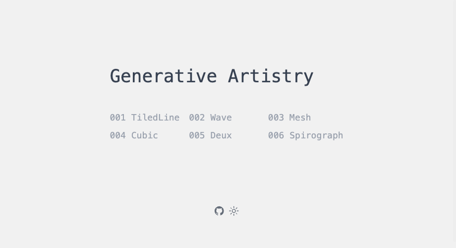

# Generative Art

generative art by react canvas.



## Development setup

```sh
git clone https://github.com/liou666/generative-art.git
cd generative-art
pnpm install
pnpm dev
```

##  Contributing

If you have a suggestion that would make this better, please fork the repo and create a pull request. Any contributions you make are greatly appreciated! 

Don't forget to give the project a star! Thanks again!

1. Fork it (<https://github.com/liou666//fork>)
2. Create your feature branch (`git checkout -b feature/fooBar`)
3. Commit your changes (`git commit -am 'Add some fooBar'`)
4. Push to the branch (`git push origin feature/fooBar`)
5. Create a new Pull Request

